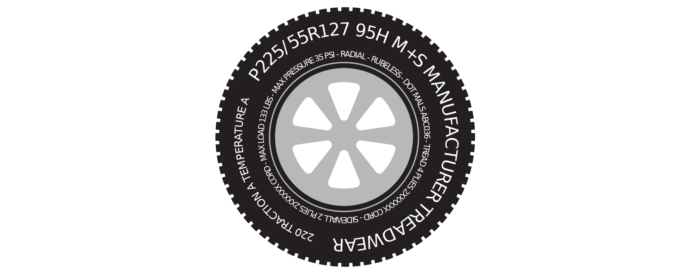

# Pneus

- **Durée**: 2 périodes + travail à la maison

## Le marquage des pneus

Les pneus de véhicules sont marqué selon un standard international à unités mixtes : le [DOT Code](https://en.wikipedia.org/wiki/Tire_code). Ce code de marquage des pneus, volontairement simplifié pour ce travail, est le suivant :



On peut y lire:

```text
P215/65R15
-    -- --
|---  |  |
| |   |  '-- Diamètre de la jante en pouces
| |   '----- Rapport en pourcent entre la hauteur
| |          du flanc et la largeur du pneu
| '--------- Largeur du pneu en millimètres
'----------- Passenger Car (voiture avec des passagers)
```

## Cahier des charges

Réalisez un programme permettant de saisir en arguments :

1. Une caractéristique de pneu (*i.e.* `P215/65R15`)
2. Une distance exprimée en kilomètres (*i.e.* `12.54`)

Ce programme doit calculer et afficher sous forme de tableau :

1. Le diamètre de la roue en centimètres.
2. Le périmètre de la roue en mètres.
3. Le nombre de révolutions par kilomètres.
4. Le nombre de révolutions totales pour la distance fournie.

> **Attention** à la conversion des unités !

### Affichage

L'affichage doit être dynamique. C'est à dire que la largeur du tableau varie en fonction de la taille des éléments affichés.

```text
$ ./tire P999/99R99 99999999999999
┌─────────────┬────────────────────────┐
│ Diameter    │              449.26 cm │
│ Perimeter   │               14.11 m  │
│ Revs/km     │               70.9     │
├─────────────┼────────────────────────┤
│ Revolutions │ 7085172717646042.00    │
└─────────────┴────────────────────────┘
```

```text
$ ./tire P10/10R9 0.001
┌─────────────┬────────────┐
│ Diameter    │   23.06 cm │
│ Perimeter   │    0.72 m  │
│ Revs/km     │ 1380.4     │
├─────────────┼────────────┤
│ Revolutions │    1.38    │
└─────────────┴────────────┘
```

La distance est optionnelle est si elle est omise, le nombre total de révolutions n'est pas affiché:

```text
./tire P225/55R15
┌─────────────┬───────────┐
│ Diameter    │  62.85 cm │
│ Perimeter   │   1.97 m  │
│ Revs/km     │ 506.5     │
└─────────────┴───────────┘
```

Le tableau utilise les [Box-drawing characters](https://en.wikipedia.org/wiki/Box-drawing_character) unicode. Vous pouvez reprendre les caractères de ce fichier [README.md](README.md).

Veillez également à l'alignement du séparateur décimal et au nombre de décimales visibles.

### Code d'erreur

Le programme retourne les status de sortie suivants :

- `0` Le programme s'est terminé correctement ;
- `1` Mauvais marquage de pneu ;
- `2` Pas assez d'arguments ;
- `3` Trop d'arguments ;
- `4` Mauvaise lecture de la distance parcourue.

## Style de code

Rappelez-vous, la première qualité d'un code outre son aspect fonctionnel est qu'il doit être lisible par d'autres développeurs :

- le *scope* des variables doit être réduit au minimum ;
- le nom des variables soit être parlant et non ambigu ;
- le mot clé `const` sera utilisé pour indiquer qu'une variable n'est pas destinée à être modifiée dans la suite de l'exécution ;
- les constantes litérales seront documentées.

La ligne suivante démontre un mauvais exemple de code. En effet, `diam` abrégé demeure ambigu et pourrait ainsi pourrait faire référence soit au diamètre de la roue, soit à celui de la jante. Il n'est pas clair auxquelles variable s'appliquent les constantes littérales, et quelle est la construction logique du calcul.

```c
const double diam = wheel * 0.02540 + 2 * width / 1000.0 * ratio / 100.;
```

Une convention de nommage souvent utilisée est de suffixer les variables avec leurs unités correspondantes : `foo_inches`, `foo_meters`... Afin de réduire le nommage, on peut définir que que si absent, l'unité est l'unité SI correspondante. Donc `width` serait exprimé en mètres et `weight` en kilograms. Dans ce cas, un commentaire en tête de programme expliquant cette convention peut être utile au développeur qui découvrirait le code.

Le choix est noms est également important, n'hésitez pas à utiliser un vocabulaire varié et précis : `pneu` (*tire*), `jante` (*rim*), `flanc` (*sidewall*). En cas de doute, le dictionnaire et *Google Translate* sont de bons alliés.

Voici l'exemple ci-dessus remanié pour accroître sa lisibilité :

```c
const double rim_diamter = rim_diameter_inches * 0.02540;
const double tire_width = tire_width_mm / 1000.0;
const double tire_sidewall = tire_width * (ratio_percent / 100.0);
const double wheel_diameter = rim_diameter + 2 * tire_sidewall;
```

Selon les cas, vous pourriez également considérer que certaines constantes litérales telles que `0.02540` demeurent ambigues. Il peut valoir la peine de les documenter préférablement avec une constante supplémentaire :

```c
const double inch_to_meters = 2.54e-3;
```

C'est à vous de choisir l'optimal entre lisibilité et précision. L'exemple suivant est certes très précis, mais il perd en lisibilité :

```c
const double inches_to_millimeters = 25.4 // https://en.wikipedia.org/wiki/Inch
const double millimeters_to_meters = 1 / 1000.0
const double inches_to_meters = inches_to_millimeters * millimeters_to_meters;
const double rim_diamter = rim_diameter_inches * inches_to_meters;
const double tire_width = tire_width_mm * millimeters_to_meters;
const double percent_to_factor = 1 / 100.0;
const double tire_sidewall = tire_width * (ratio_percent * percent_to_factor);
const double sidewall_to_sidewalls = 2.0;
const double wheel_diameter = rim_diameter + sidewall_to_sidewalls * tire_sidewall;
```
## Taille du tableau dynamique

Pour ajuster la taille du tableau dynamiquement, voici un exemple avec des macros qui pourrait vous être utile :

```c
#include <stdio.h>
#include <stdlib.h>

#define REPEAT(A, N) { for(int i = 0; i < (N); i++) printf(A); }

int main() {
    const int digits = 8;
    REPEAT("*", digits);    
}
```

Indication : utilisez le modificateur `*` dans `printf`.

## Tests

Les tests utilisent le paquet Python `baygon` et ils sont décrits dans le fichier `tests.json`. Pour exécuter les tests, utilisez `make test`.

```console
make test
```

## Travail d'approfondissement (facultatif)

### Affichage de l'aide et de la version

Les options suivantes seraient considérées :

- `--help` affiche l'aide et termine le programme ;
- `--version` affiche l'auteur et la version puis termine le programme.
